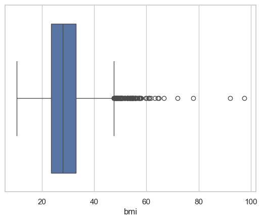
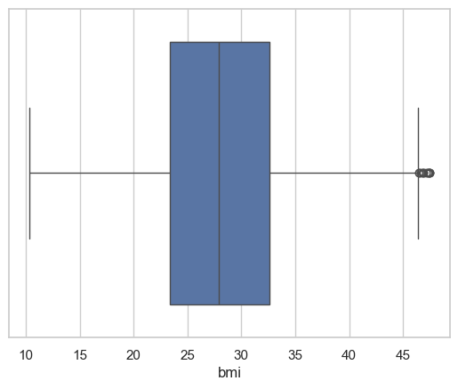
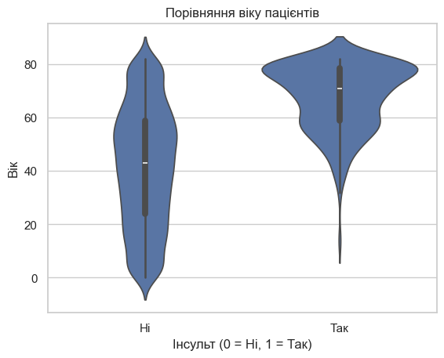
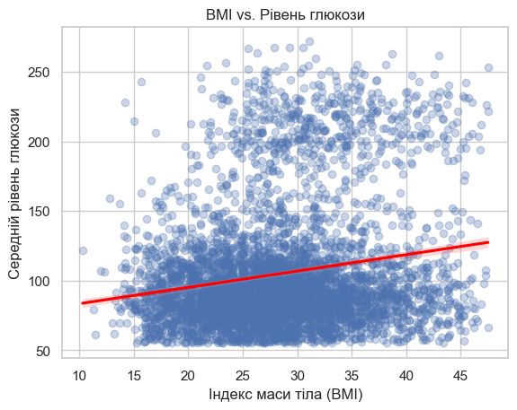
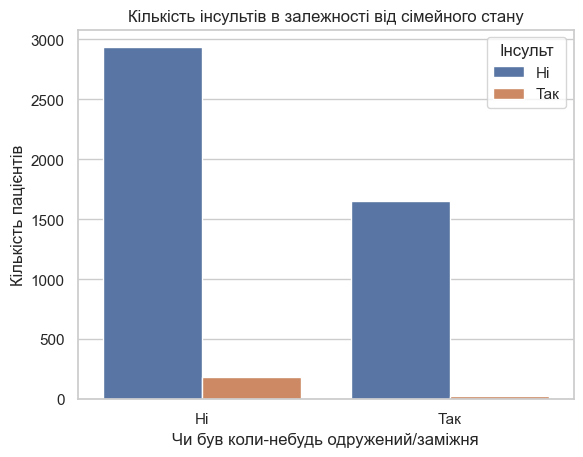
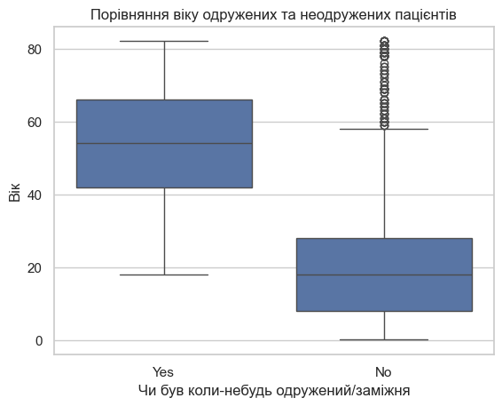

# Лабораторна робота №1: Аналіз датасету "Stroke Prediction"

Це проект з аналізу даних, виконаний в рамках лабораторної роботи. Метою було знайти набір даних, очистити його, провести статистичні розрахунки та візуалізувати знайдені залежності.

## Як запустити цей проект

1.  Склонуйте репозиторій.
2.  Переконайтесь, що у вас встановлено `uv`.
3.  Створіть віртуальне середовище та встановіть залежності:
    ```bash
    uv venv
    source .venv/bin/activate
    uv sync
    ```
4.  Запустіть інтерактивний зошит Marimo:
    ```bash
    marimo edit main_nb.py
    ```

## Файли у цьому репозиторії

-   `main_nb.py`: Основний код аналізу в зошиті Marimo.
-   `metadata.md`: Детальний опис набору даних та його стовпців.
-   `statistical_results.md`: Результати статистичних обчислень.
-   `cleaned_dataset.csv`: Набір даних після очищення від пропусків та викидів.
-   `normalized_dataset.csv`: Набір даних з доданими нормалізованими стовпцями.
-   `pyproject.toml`: Список залежностей проекту.
-   `/images`: Папка з усіма графіками.

## Візуальний аналіз та ключові висновки

### 1. Підготовка даних: Очищення стовпця BMI

Першим кроком аналізу було очищення даних від пропущених значень та статистичних викидів. Для ідентифікації викидів було використано діаграму розмаху (Box Plot).

**До видалення викидів:**


**Після видалення викидів:**


### 2. Аналіз основних факторів ризику інсульту

Після очищення даних було досліджено зв'язок між ключовими медичними показниками та ризиком інсульту.

**Вік та інсульт:**
Графік чітко показує, що вік є найсильнішим фактором ризику. Медіанний вік пацієнтів, які перенесли інсульт, є значно вищим.


**Індекс маси тіла (BMI) та інсульт:**
Спостерігається, що медіанний BMI у пацієнтів з інсультом дещо вищий, що вказує на те, що надмірна вага може бути одним із факторів ризику.


### 3. Розвінчання міфу: "Кореляція — це не причинно-наслідковий зв'язок"

Під час аналізу було виявлено цікаву, але оманливу кореляцію

**Початкове спостереження:**
На перший погляд, дані показують, що серед людей, які коли-небудь були у шлюбі, абсолютна кількість інсультів значно вища.


**Спростування (Debunk):**
Однак, це класичний випадок хибної кореляції. Подальший аналіз показує, що група одружених людей в середньому **значно старша** за групу неодружених.


**Висновок:** Справжньою причиною вищої кількості інсультів є **вік**, а не сам факт шлюбу. Цей приклад чудово ілюструє важливість критичного підходу до даних та пошуку прихованих факторів.

